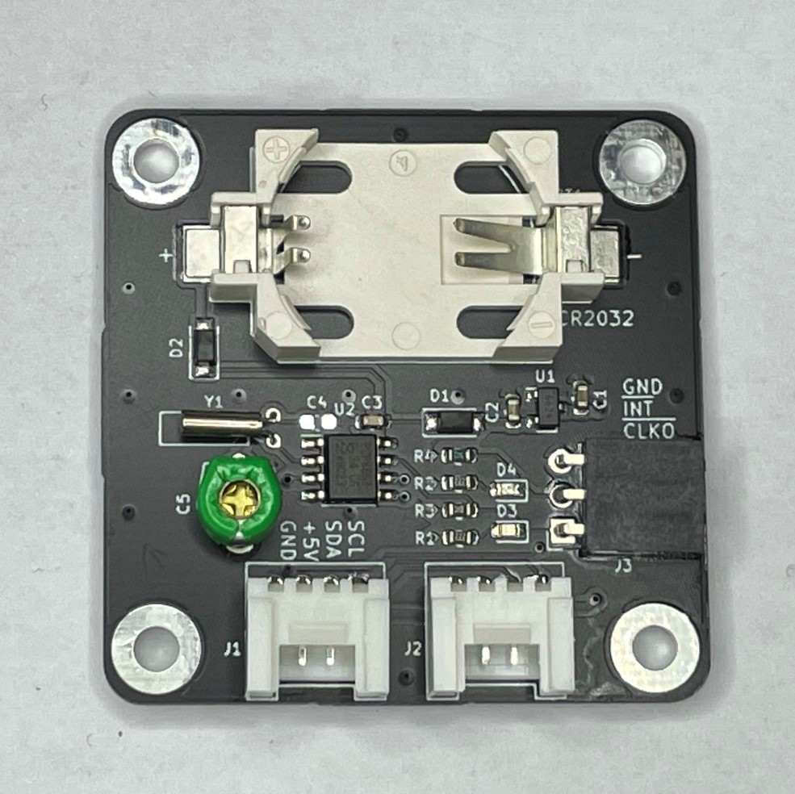
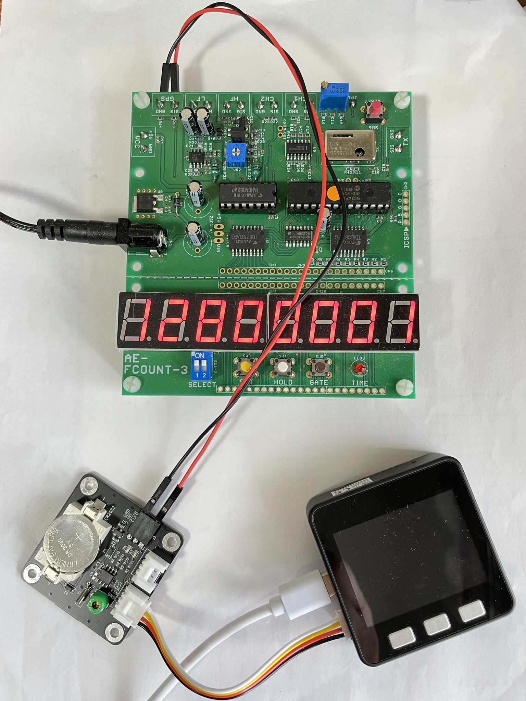
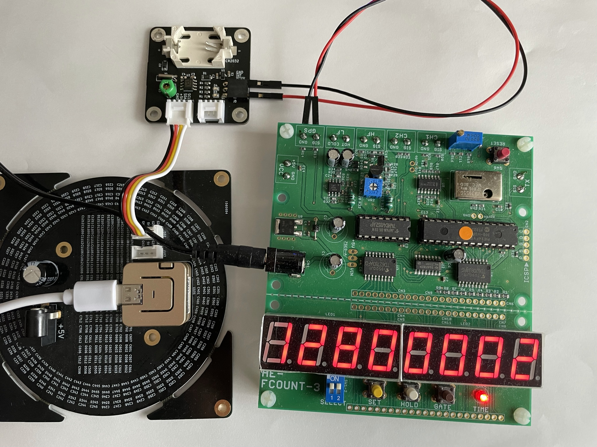

## PCB-RTC-PCF8563-for-M5
a PCB of PCF8563-RTC with Grove-I2C for M5Stack and M5Atom synchronized with NTP

# M5 用リアルタイムクロック (RTC) 基板

　M5 シリーズ用に作成した RTC 基板です。水晶振動子 により高精度に時刻を刻みます。バッテリ・バックアップにより本体が電源オフの状態でも時刻を維持します。

- M5 仕様の Grove コネクタ

    　M5 製品の Grove コネクタ仕様（電源 5V, 信号レベル 3.3V）に合致します。Grove コネクタが 2 個あり、I2C デバイスの数珠つなぎができます。

- M5 製品と同仕様の RTC

    　M5Core2, M5StickC/C Plus, M5CoreInk, M5Paper, M5Camera/F/X に内蔵されている BM8563 と互換の RTC(PCF8563) を搭載し、M5 用の多くのソフトウェアを利用できます。

- INT, CLKO 信号出力

    　PCF8563(BM8563) の INT 信号、CLKO 信号を、基板上のピンソケットから取り出せます。これらの信号は 3.3V に 10kΩ でプルアップしています。基板上の LED（INT: 赤、CLKO： 緑）で信号オンを確認できます。 

- 時刻の精度を改善

    　基板上にトリマコンデンサを搭載し、時刻の精度を改善できます。出荷時には、以下の機器を用いて室温（15 - 25 ℃程度のどこか）にて調整済です。（※固定コンデンサ C4, トリマコンデンサ C5 はどちらか一方を実装します。トリマコンデンサを実装している場合、C4 には部品がありません。）

>> 1. 周波数カウンタ (1) を GPS 受信機 (2) の 1PPS 信号で校正
>>>> (1) 秋月電子通商「８桁周波数カウンターキット」 [AE-FCOUNT3](
https://akizukidenshi.com/catalog/g/gK-13432/)
>>>>
>>>> (2) 秋月電子通商「ＧＰＳ受信機キット～」 [AE-GYSFDMAXB](
https://akizukidenshi.com/catalog/g/gK-09991/)
>> 2. RTC 基板の CLKO から 1Hz 信号を取り出し、1PPS の代わりに入力
>> 3. 周波数カウンタの表示が所定の値に近づく様、RTC 基板上のトリマを調整

# ソフトウェア
　RTC の使用にあたっては、一般に入手可能なライブラリを利用することができます。

　他の I2C デバイスとの共存や、NTP との相互補完を想定したサンプルプログラムを作成し、BF-027 フォルダに置きました。詳細な説明は Qiita にあります。

1. BF_Pcf8563.h, BF_Pcf8563.cpp

    RTC PCF8563(BM8563) にアクセスし、時刻、アラーム、タイマー、クロック出力などの機能を使用するためのライブラリです。

2. BF_Pcf8563Test.h, BF_Pcf8563Test.cpp

    上記 BF_Pcf8563.cpp の機能をテストするプログラムです。

3. BF_RtcxNtp.h, BF_RtcxNtp.cpp

    RTC と NTP を相互補完的に使用するためのプログラムです。
    
    ※ arduino-ESP32(1.0.6) 以降が必要です。M5Stack 社が提供している環境 arduino-ESP32(1.0.4) では使用できません。

4. BF_Wifi.h, BF_Wifi.cpp

    Wifi 接続に関するプログラムです。

5. BF-027.ino

    上記プログラムの使用例です。

(1) Qiita [「M5Atom, M5Stack Core 用の I2C リアルタイムクロック基板を作って動かす」](https://qiita.com/BotanicFields/items/dc35e12423be8f6e9b4e)

(2) Qiita [「ESP32 において NTP の時刻同期を捕まえて RTC を更新する」](https://qiita.com/BotanicFields/items/f1e28af5a63e4ccf7023)

